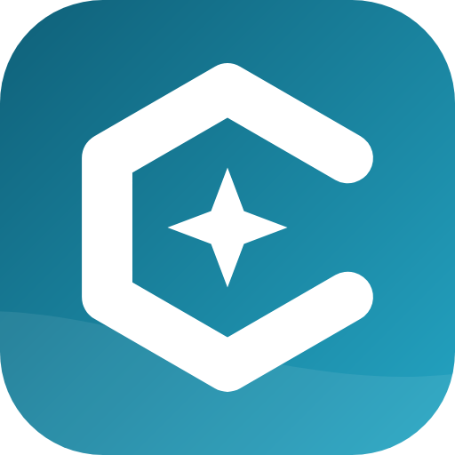
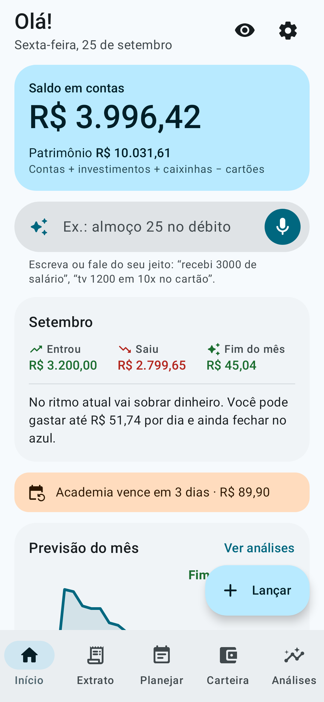
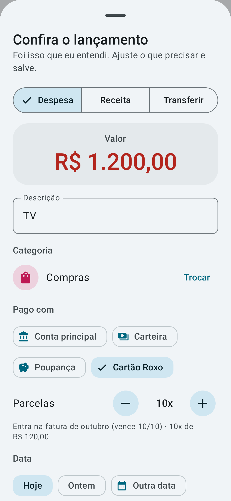
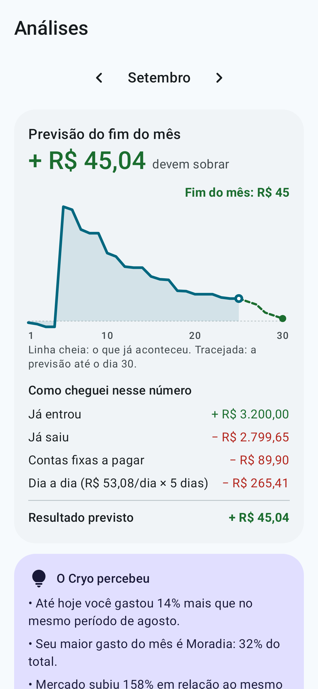
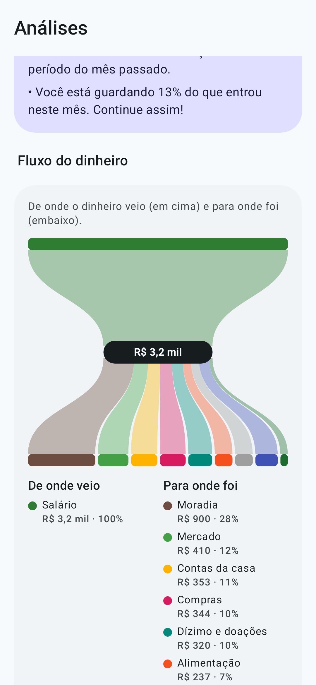
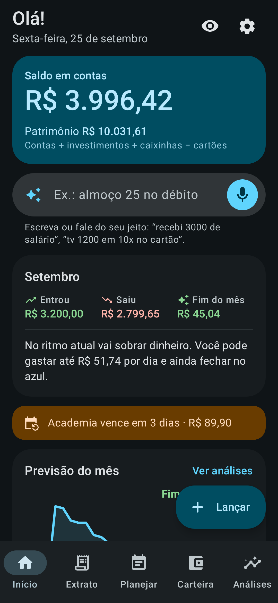

<p align="center">
  
</p>

<h1 align="center">Cryo</h1>

<p align="center"><b>Seu dinheiro, claro como gelo.</b><br>
App Android de finanças pessoais: simples de usar, completo, offline e de código aberto.</p>

<p align="center">
  
  
  
  
  
</p>

## O que ele faz

- **Registro por frase ou voz.** Escreva ou fale "almoço 32,50 no débito" ou "tv 1200 em 10x no cartão". O Cryo entende o valor, a categoria, a conta, a data e as parcelas. Você só confere e salva.
- **Previsão do fim do mês.** Mostra quanto deve sobrar no ritmo atual e quanto dá para gastar por dia.
- **Calendário de calor e fluxo do dinheiro.** Veja em quais dias você mais gasta, de onde o dinheiro veio e para onde foi.
- **Cartões de crédito.** Faturas, limite disponível e compras parceladas, cada parcela na fatura certa.
- **Planejamento.** Contas fixas com lembrete, orçamento por categoria e metas com valor mensal sugerido.
- **Investimentos e transferências** entre contas.
- **Material You**, tema claro e escuro.

## Privacidade

- Os dados ficam só no celular. **O app não tem permissão de internet.**
- Sem cadastro, sem anúncios e sem rastreamento.
- Bloqueio com digital, rosto ou senha do aparelho.
- Backup em arquivo `.json` e exportação para planilha `.csv`, quando você quiser.

O registro por voz usa o reconhecimento de fala que já está instalado no celular. Digitar a frase funciona sempre.

## Instalação

Em breve no F-Droid.

## Compilar a partir do código

Requisitos: JDK 17 ou mais novo e o Android SDK (plataforma 36).

```bash
./gradlew assembleRelease     # APK sem assinatura em app/build/outputs/apk/release/
./gradlew testDebugUnitTest   # testes automáticos (regras, banco de dados, backup e telas)
```

Para assinar com a sua própria chave, crie `keystore/keystore.properties` com `storeFile`, `storePassword`, `keyAlias` e `keyPassword`. A pasta `keystore/` nunca vai para o repositório.

Para gerar de novo as imagens da página do F-Droid (pasta `fastlane/`):

```bash
./gradlew testDebugUnitTest --tests '*StoreAssetsTest' -PstoreAssets=true
```

### Como o código está organizado

| Pasta | Conteúdo |
|---|---|
| `domain/` | Regras sem Android: saldos, faturas e parcelas, previsão, fluxo do dinheiro e o interpretador de frases (`PhraseParser.kt`) |
| `data/` | Banco de dados (Room), ajustes, backup e categorias padrão |
| `ui/` | Telas em Jetpack Compose com Material 3 |
| `notify/` | Lembretes de contas fixas (WorkManager) |

## Contribuir

Sugestões e relatos de problemas são bem-vindos na aba [Issues](https://github.com/H3yK0/cryo/issues).

## English

Cryo is a simple yet complete personal finance app for Android: log expenses by typing or speaking a phrase, see an end-of-month forecast, a spending heatmap and a money-flow chart, and manage credit cards with installments, recurring bills, budgets, savings goals and investments. Everything stays on the device: the app has no internet permission, no ads and no tracking. The interface is currently in Brazilian Portuguese only.

## Licença

Copyright © 2026 Hanry Franco

Este programa é software livre: você pode redistribuí-lo e/ou modificá-lo sob os termos da [GNU General Public License](LICENSE), publicada pela Free Software Foundation, versão 3 da licença ou (a seu critério) qualquer versão posterior. Ele é distribuído na esperança de ser útil, mas **sem nenhuma garantia**.
